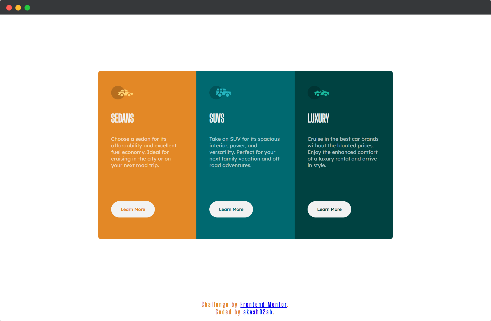
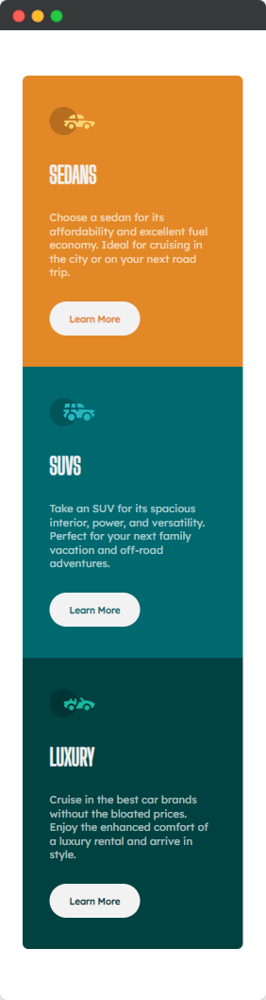

# Frontend Mentor - 3-column preview card component solution

This is a solution to the [3-column preview card component challenge on Frontend Mentor](https://www.frontendmentor.io/challenges/3column-preview-card-component-pH92eAR2-).

## Table of contents

- [Frontend Mentor - 3-column preview card component solution](#frontend-mentor---3-column-preview-card-component-solution)
  - [Table of contents](#table-of-contents)
  - [Overview](#overview)
    - [The challenge](#the-challenge)
    - [Screenshot](#screenshot)
    - [Links](#links)
    - [Built with](#built-with)
    - [What I learned](#what-i-learned)
  - [Author](#author)

## Overview
 Three different colored cards that has icon, title, description and a button.
### The challenge

Users should be able to:

- View the optimal layout depending on their device's screen size
- See hover states for interactive elements

### Screenshot

**Desktop**

**Mobile**

  

### Links

- Solution URL: [Frontend Mentor](https://your-solution-url.com)
- Live Site URL: [Hosted on Netlify](https://your-live-site-url.com)

### Built with

- Semantic HTML5 markup
- CSS custom properties
- Flexbox
- Mobile-first workflow

### What I learned

I wanted to assign `color` to button text as that of the `background-color` of the card without assigning different color to different button.
 
I was able to achieve it using `color: inherit;` property. For `inherit` to work it's parent element should also have `color` property assigned to it.

## Author

- Website - [https://akashbanchhor.netlify.app](https://akashbanchhor.netlify.app)
- Frontend Mentor - [@akash02ab](https://www.frontendmentor.io/profile/akash02ab)